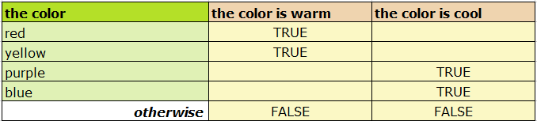

# Intelligent Advisor Flow Migrator

*migrator* is a Node.js tool that migrates the rules contained inside an Oracle Policy Modeling
project into an Intelligent Advisor Flow project.  It does not currently handle interview screens
or mapped data.

The migrator is somewhat configurable via a settings file, but the full source of the migrator is
provided so it can be adapted to the needs of particular projects.

## Usage

You'll need Node.js to build and run the migrator:

    npm install

Then you can build a standalone Node.js executable:

    npm run build
    node build/migrate.js [project-directory] --template [template-project.json] --settings [settings.json] --outproject [project.json]

Or run the tool directly from source:

    npx ts-node src/main [project-directory] --template [template-project.json] --settings [settings.json] --outproject [project.json]

Arguments:

- *project-directory* is a directory containing a Policy Modeling project (not the path to the
  actual xprj file).  Both the "Rules" folder and the "bin" folder should be present there.

- *template-project.json* (optional) is a flow project (exported from a Hub) that the migrated
  rule documents will be added to.  The template is not modified, and if not provided the rules
  will be placed into an empty project.  See below for more detail.

- *settings.json* (optional) is a file that controls some aspects of the migration that you might
  want to tweak.  See below for more detail.

- *project.json* (optional) is the filename where the new migrated flow project will be saved.
  This can be imported into a Hub (make sure the necessary scheme is also imported).  If not
  provided, the migrated project will be written to the console.

## Template Project

Anything in the template project will also appear in the migrated project. For example, screens
that collect data and data actions will be copied across.

Existing rule documents in the template project are also kept, which may be useful for repeated
conversions where some common bridging logic needs to be included.  If a previously migrated
project is used as the template, remove the old migrated documents first.

The flow scheme referenced by the template project will also be referenced by the migrated project,
so make sure you have the flow scheme if you plan to import the migrated project into a different
Hub from the template project.  If the template project is not provided, the migrated project will
reference a flow scheme called "interview-scheme".

## Settings

By default the migrator will migrate all your rule documents, with English function calls (even if
it was originally in some other language!), dates in yyyy-mm-dd format and numbers in #,###.##
format.  A settings file is needed to change any of this behavior, and there are some other useful
things you can change that may help streamline migrations.

The settings file is a JSONC file (a JSON file allowing comments) that you'll need to edit by hand.
An "Example-Settings.json" file has been provided to help get started.

The following settings are available:

- *ruleDocumentFilter*: An object in which the keys are regular expression patterns, and the
  values are true/false values.  Each rule document's name (including the path relative to the
  project's 'Rules' folder) is matched against every pattern and when there is a match, the value
  indicates whether to migrate that document.  True means migrate and false means don't migrate.

  Order is significant, and when multiple patterns match the document name, the earliest one
  applies. If no patterns match, the document is migrated by default. These are not case-sensitive,
  but don't forget to escape the '.' character, as it has special meaning within a regex, and the
  backslash itself will also have to be escaped in the JSON file. For example:

  ```
  "ruleDocumentFilter":{
      "documentation/notes\\.docx": false,
      "not-bad-rules": true,
      "bad-rules":false
  }
  ```

- *collapseEntities*: An array of strings.  Entities named in this array are removed from the data
  model during migration.

  Sometimes entities are only included in the data model to facilitate mapping.  These entities are
  often singleton entities (that is, only one instance of the entity is expected to exist), and
  rules are written to extract values out of that instance.

  Intelligent Advisor flows are more flexible with mapping out data, and typically won't need
  these singleton entities, so you can "collapse" them as part of the migration.  This means the
  attributes of those entities will be rolled up into the parent entity, and some functions that
  reference the collapsed entity will be simplified.  For example, "Exists(the customer, the
  customer is satisfied)" will become just "the customer is satisfied".
		
- *attributeRename*: An object where the keys are regular expression patterns, and values are
  string values to replace the pattern with, when it is found inside a migrated attribute (or
  relationship).

  Oracle Policy Modeling allows some characters in attribute text that flows don't allow in field
  names, such as parenthesis. The migrator will rename attributes to remove some of these
  characters, but you might want to use this setting to supply better name in some specific cases.
  You also might want to tweak some names if they belong to a collapsed entity.

  Both attributes and relationships are run through the attributeRename filter, and patterns do
  not need to match the entire attribute text.  They are also case-insensitive. Unlike the
  *ruleDocumentFilter*, all of the patterns are applied (in order).

  For example:

  ```
  "attributeRename":{
      "\\(adjusted for inflation\\)": ", adjusted for inflation",
      "all instances of the thing": "the things"
  }
  ```

- *keepConclusionLegends*: A Boolean value (defaults to false).  Excel rule documents allow
  attributes to be given a short name (a "legend") that can be used instead of the full text of
  an attribute, but only within the document.  Web-authored rule documents don't have an exact
  equivalent, so the migrator instead creates rules in the form "LEGEND=ATTR" to simulate the
  legend.  However, this only works when an attribute's value is being retrieved (for example in
  a condition or calculating the conclusion's result).

  When a legend is used as the heading in a conclusion column, it is the legend that receives
  the value and the rule must instead be written as "ATTR=LEGEND". This can get messy when other
  documents already defined that legend the other way around.  The migrator is smart enough to
  rename it in that situation to avoid clashes, but it doesn't gain very much to use a legend
  here so by default the migrator just replaces legends with the full text when they appear in a
  conclusion.  If you really want to keep the legends in conclusion columns though, you can set
  this setting to true.

- *language*: A structured object containing the language settings to migrate to.  Rules are
  rewritten to match these language settings.  Functions will be written in that language, number
  values will be reformatted to match the format settings, and so on. This means the source
  project doesn't need to exactly match the settings given here.  You could migrate a German
  language project into Spanish, with some caveats.

  In a few situations (most notably, "Apply Sheet" rules in Excel) there isn't enough
  information to rewrite the rules and it will fall back to copying the text as is.  Also, a few
  keywords in Excel are recognized via the language settings given here (such as the heading
  "Condition" for English, or "condición" for Spanish) and if there is a language mismatch then
  the headings won't be accurately recognised.

  For example:
  ```
  "language":{
      "language":"en",
      "formats":{
          "argumentSeparator":",",
          "dateFormat":"yyyy-mm-dd",
          "decimalSeparator":".",
          "thousandsSeparator":","
      }
  }
  ```

## Compatibility

Some rules will need manual intervention to migrate.  In general, where the migrator knows
something may not work the same after migration, it will warn you.  These might be rule structures
that have no equivalent in web-authored rules, or are too complex to migrate.  There are a few
things the migrator can't reliably warn you about, and for these you will need to use your own
judgement.

Here are some specific compatibility issues to consider when migrating:

- Inferred entities.  Directly inferring child instances via a containment relationship (the most
  common method) will migrate cleanly, but other methods have no equivalent, and will issue a
  warning.  Some examples are inferring an entity using a non-containment relationship, or inferred
  associative entities.  Often these are used to work around mapping difficulties in Oracle Policy
  Modeling that have been solved in flows, such as mapping out a subset of the instances that have
  been mapped in.  This can be done more cleanly in flows by mapping out a filtered reference list
  (without defining any extra objects), but the migrator can't make this change automatically.

- Identity uniqueness for inferred entities. In Policy Modeling rules, inferred entities always
  set some kind of identity value as part of the rule (usually the identifying attribute). If two
  instances are inferred with the same identity value, then only the first instance gets created,
  and later instances will be skipped.  Sometimes this is useful, but often it is unexpected.  With
  web-authored rules, every true condition results in a record being inferred, which may result in
  a change if your rules relied on this behavior.

- "Apply Sheet" rules in Excel.  These have no direct equivalent and are rewritten as regular
  table rules, but this only works for attributes, not for inferred entities.  Inferred entity rules that use "Apply Sheet" will need to be collapsed down to a single table.

- Empty cells in conclusion columns.  These behave differently after migration.  In Oracle Policy
  Modeling, a blank conclusion cell is skipped entirely for that conclusion, as if the entire row
  doesn't exist, whereas in web-authored projects, the blank cell is included.

  For example, when Policy Modeling interprets the following rule, a color value of "red" will set
  "the color is cool" to false, because the "red" conclusion cell is empty and the other conditions
  don't trigger either.  In web-authored rules, the empty conclusion is still included and means
  the "the color is cool" will be null for that case. Similarly, when the color is "purple", Policy Modeling sets "the color is warm" to false, whereas web-authored rules will set it to a null value.
 
  

- Non-rule content (comments) in Excel is not included in the migrated output because there isn't
  an equivalent tabular-structure to migrate them to.

- Generic conclusion columns in Excel. These do not migrate.  This is where the conclusion column
  says just 'conclusion' and each cell concludes a different Boolean attribute to true.  This has
  no equivalent in web-authored rules and is a fairly uncommon pattern so the migrator does not
  handle it.

- Distinguishing unknown versus uncertain.  Any reference to either unknown or uncertain is
  translated into 'null' by the migrator, but if the distinction between unknown and uncertain is
  significant, the rules may need to be manually adjusted.

- Equality comparisons with uncertain and unknown.  In Policy Modeling rules, values can only be
  checked for uncertainty using the IsUncertain() function, and are never considered equal to
  uncertain.  For example, the condition "value = uncertain" always returns uncertain, not false,
  even when the value is uncertain.  In web-authored rules, a null value is considered to be equal
  to another null value, and not equal to a value that isn't null.  In other words, "value = null"
  is strictly either true or false.

- Multiline conditions with ExistsScope() and ForAllScope().  Where the condition requires
  multiple lines to express (for example, two conditions connected by 'and'), the migrator creates
  an intermediate Boolean attribute for the condition and rewrites the condition using that.
  However if the condition makes a reference to the parent scope, then it won't work when rewritten
  as the parent scope doesn't exist.  Additionally, ExistsScope() and ForAllScope() are sometimes
  used with an alias and this won't be migrated (see next point).

- Aliases in cross-entity reasoning. These cannot be migrated because they have no equivalent in
  web-authored rules. For example the use of "the other person" as an alias in the following OPM
  rule:

  ```
  the person (the other person) is a member of people with the same name if
      the person's name = the other person's name
  ```

- Datetime and time-of-day values.  Web-authored rules currently have no support for time or
  datetime values.  One common use of a datetime is for a record timestamp which can often be
  handled via a text field instead.

- Temporal reasoning.  Web-authored rules currently have no support for temporal reasoning, so any
  call to a temporal function will be migrated to a non-existent function name, which the flow
  editor will flag as an error.

- Error/event rules.  These are turned into simple Boolean rules, so while the rule should still
  trigger as before, it will not automatically be considered an error when it does.

- Transposed Excel rules. These are rules where the headings run down instead of across, and the
  condition/conclusion values are to the right of the headings instead of underneath.  These rules
  are not understood by the migrator and are skipped.

## Migrator Technical Details

If you want to make changes to the migrator, it may be helpful to understand more about
[how it works](migrator-technical.md).
